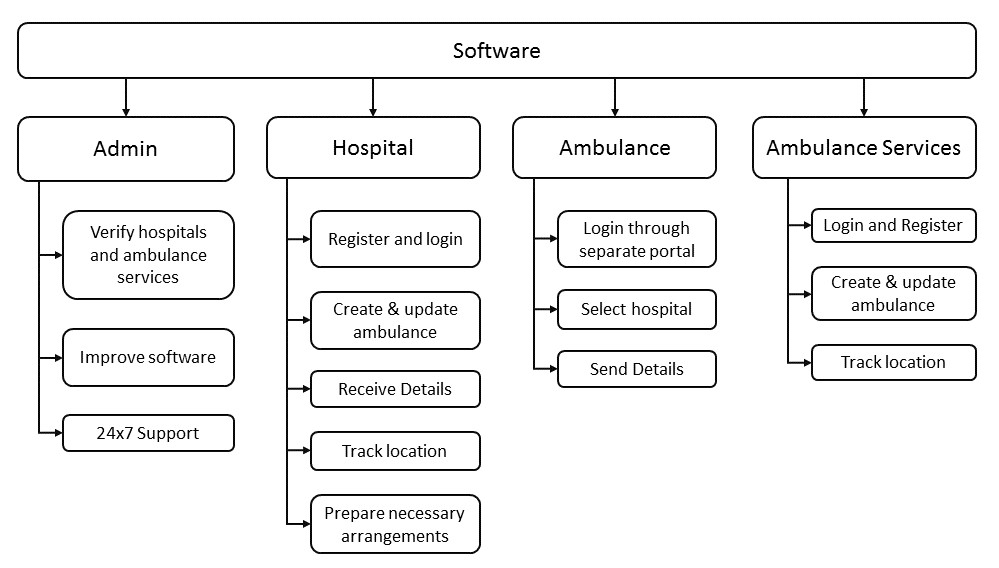
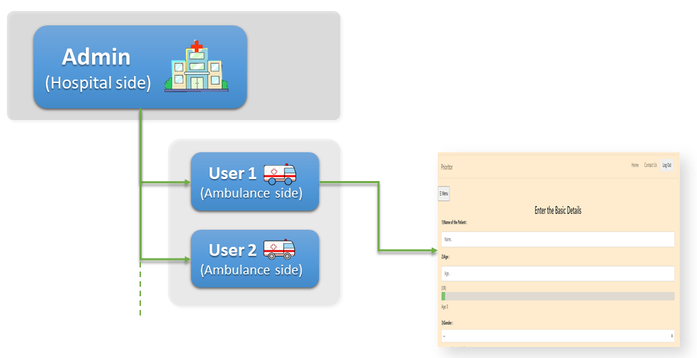
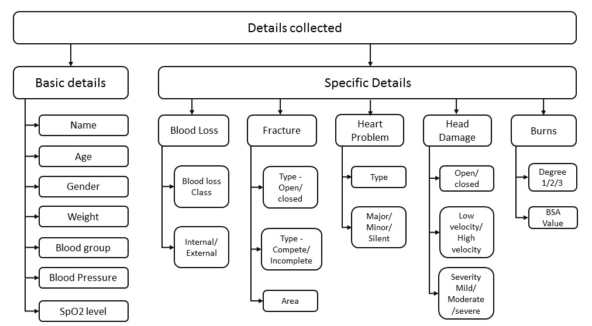
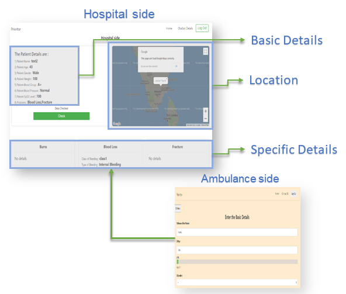

 `Prioritor`

## Live Demo Website

- `Prioritor` [click here](https://prioritordemo.herokuapp.com/)
- Backend is not enabled here. Instead download the project to the local computer and import the [dataentering.sql](dataentering.sql) in phpmyadmin and run the file in the browser.

## Problem Statement:

The purpose of an effective Emergency medical system is to provide _timely medical care to prevent death or disability_.
Delays in arrival to the Emergency Department (ED), and in receiving treatment can lead to **severe negative outcomes and poor prognosis**.
When we look at delay in treatment, one of the biggest contribution factors that comes to mind is the **breakdown in communication**.
Delays in getting care can lead to: _Increased emotional distress, Increased complications, Higher treatment costs and Increased hospitalizations_

## Our Solution:

There is a **golden hour** between life and death.
The golden hour is the period of time following a traumatic injury.
It is well established that the person's chances of survival are greatest if they receive care within a short period of time after a severe injury.

The main aim of our product is to **utilize the golden hour of the patient by intimating the patient’s condition from the ambulance to the _Accident and Emergency (A & E)_ department** of the nearby hospital before the arrival of the patient.
This helps them to know completely about the condition of the patient and helps them in _arranging the emergency room and other facilities_ before the arrival of the patient.
So that they can be **treated without any delay** when they reach the hospital.

## Video Explanation

- `Technical video` [click here](https://youtu.be/MLfC4G1-AOU)
- `Business video` [click here](https://youtu.be/v9zFJvoWgDI)

## Technologies Used

- `PHP`
  - Procedural Programming
- `Java Script`
- `SQL DataBase`
  - phpMyAdmin (XAMPP server)
- `HTML 5`
- `CSS 3`
- `BootStrap`
  - Version 4+
- `Heroku`
  - For Deployment.
- `API's`
  - Google Maps API for location.

## User Hierarchy

- Our user hierarchy comprises 4 categories of people 
   

- Each category of people has seperate roles and each are explained in the below diagram. 
   

## How it works

- **In the Ambulance**

  - The paramedic will enter the basic details of the patient. 
     

  Then the specific Details of the patient can also be entered like

  - _Blood Loss Details_
  - _Fracture Details_
  - _Burns Details_
  - _Pregnancy Details_
  - _Heart Problem Details_
  - _Head Damage Details_ 
     

- **In the Hospital**
  - The Entered Details are displayed in the hospital. 
     
